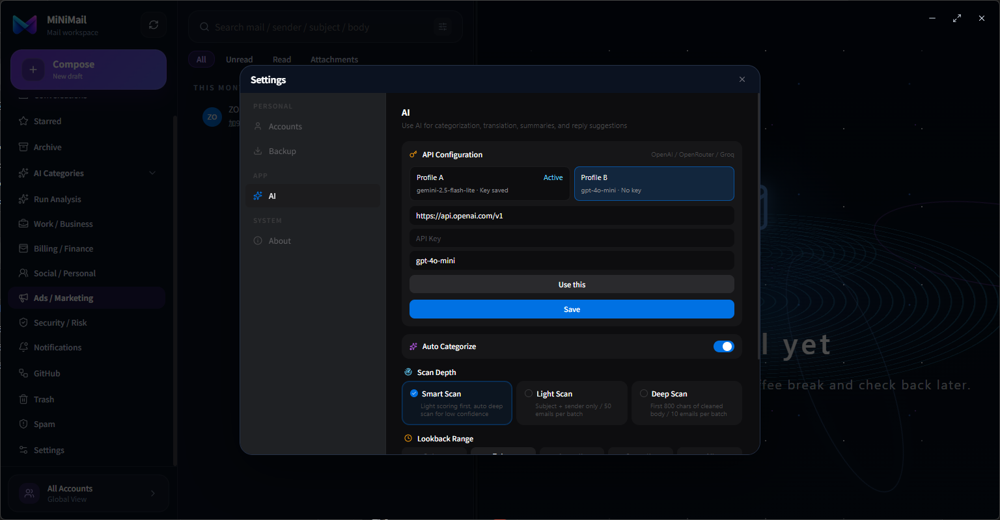
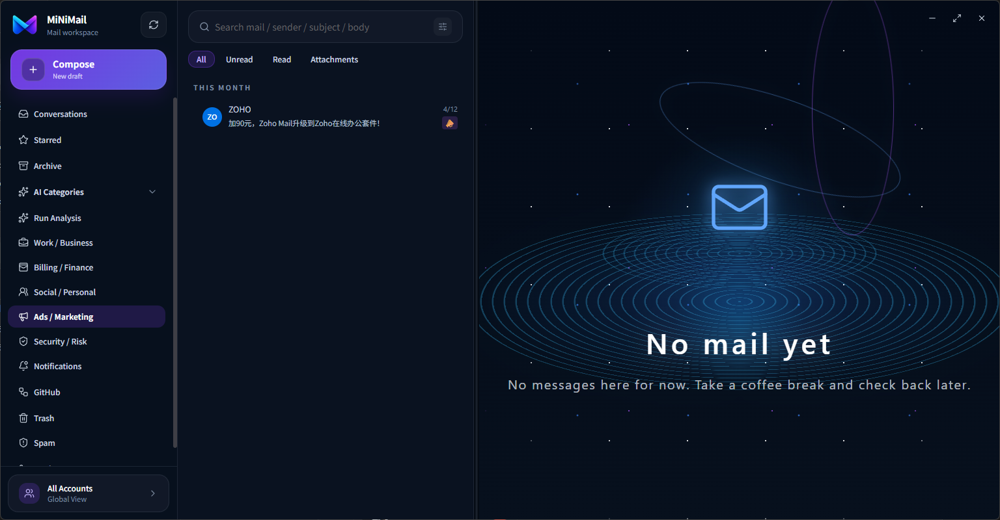

<p align="center">
  
</p>

<h1 align="center">MiNiMail</h1>

<p align="center">
  AI 原生桌面邮件客户端，让日常邮件更容易阅读、理解和处理。
</p>

简体中文 | [English](docs/README.en.md) | [日本語](docs/README.ja.md) | [한국어](docs/README.ko.md) | [Deutsch](docs/README.de.md) | [Français](docs/README.fr.md) | [Español](docs/README.es.md) | [Português](docs/README.pt.md)

MiNiMail 是一款 AI 原生桌面邮件客户端，目标是让日常邮件更容易阅读、理解和处理。

它结合本地优先的邮件缓存架构与注重隐私的 AI 能力，可帮助用户总结长邮件、提取关键信息、生成回复草稿、翻译邮件内容，并通过智能路由整理不同类型的邮件。

> 当前状态：MiNiMail 仍处于 release candidate 阶段，适合测试、演示和早期反馈，暂不建议用于关键生产邮件流程。

## 界面预览






## 演示视频


- 中文 YouTube：[MiNiMail 中文演示](https://youtu.be/YtX7JT0J8sA)
- Bilibili：[MiNiMail 演示视频](https://www.bilibili.com/video/BV1Q89kBuEL9/)

## 支持项目

- Star 这个仓库。
- 提交 issue。
- 分享反馈。
- 参与测试。

## 核心亮点

- 本地优先缓存邮件列表、正文和附件元数据，提升阅读和切换体验。
- 支持 AI 摘要、回复建议、翻译、邮件路由和结构化关键信息提取。
- 支持通用 AI 分类，并针对 GitHub 通知邮件提供专项路由。
- 支持 OpenAI 兼容接口和本地大模型，用户可根据隐私需求、成本和使用习惯选择云端或本地模型。
- 默认拦截远程图片和跟踪像素。
- 对 HTML 邮件进行安全清洗，降低邮件渲染风险。
- 支持写信、草稿、附件、已发送邮件恢复和 5 秒撤回发送。
- 支持多语言界面和多语言 README 文档。

## 隐私模型

MiNiMail 的 AI 能力围绕用户控制设计。

- 支持 OpenAI 兼容接口和本地大模型，用户可根据隐私需求、成本和使用习惯选择云端或本地模型。
- 邮件内容处理以隐私感知为核心。
- 默认阻止远程图片和跟踪像素。
- HTML 邮件在渲染前会进行安全清洗。

## 当前平台

MiNiMail 当前主要面向 Windows 桌面端。

技术栈包括：

- Electron
- TypeScript
- 本地优先邮件缓存架构
- IMAP / SMTP / OAuth 账号流程

## 路线规划

MiNiMail 当前优先打磨 Windows 桌面端体验，并计划在架构稳定后继续探索：

- macOS 桌面端支持。
- 移动端体验，包括 iOS、Android 以及其他可能的平台。
- 更完善的本地隐私模式和 AI 邮件知识能力。

这些方向会根据项目稳定性、维护成本和真实用户反馈逐步推进，暂不承诺具体发布时间。

## 发布前检查

创建发布包或内部测试包前，请运行：

```bash
npm run test:release
```

如果检查失败，不要跳过失败项。请先判断是真实回归还是测试断言过期，再做最小安全修复。

## 设计说明

完整 UI/UX case study 将由设计贡献者后续通过独立 PR 补充。

## 开源协议

本项目采用 [Apache License 2.0](LICENSE) 开源协议。

## 贡献

工程和设计贡献指南见 [CONTRIBUTING.md](CONTRIBUTING.md)。
